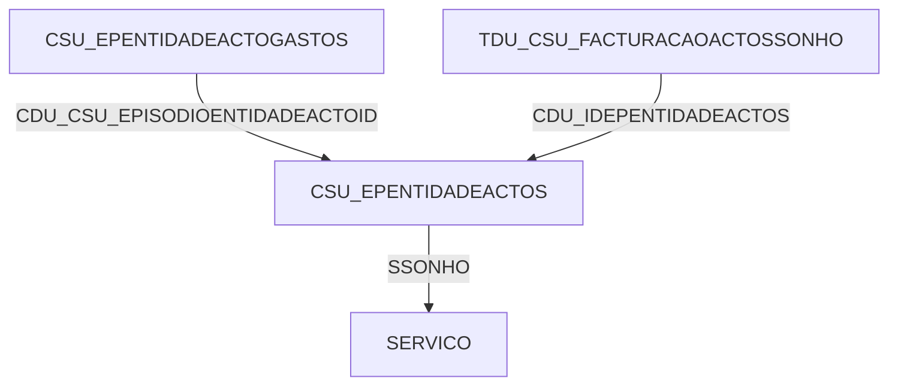

# Mapeamento Completo da Base de Dados

## Sistema Registo de Tratamentos

**Data:** 02/07/2025, 13:27:47
**Total de Tabelas:** 74

## Índice de Tabelas

### Actos e Tratamentos

- **PCE.CSU_DEFACTOS** (15 colunas, 214 registros)
- **PCE.CSU_DEFACTOSENTGASTOS** (8 colunas, 4575 registros)
- **PCE.CSU_DEFACTOSENTIDADES** (4 colunas, 258 registros)
- **PCE.CSU_DEFACTOSENTIDADES_COPIA** (4 colunas, 0 registros)
- **PCE.CSU_EPENTIDADEACTOGASTOS** (6 colunas, 151732 registros)
- **PCE.CSU_EPENTIDADEACTOS** (19 colunas, 39089 registros)
- **PCE.CSU_EPENTIDADEACTOS_BACKUP** (19 colunas, 34180 registros)
- **PCE.TDU_CSU_FACTURACAOACTOSSONHO** (6 colunas, 0 registros)
- **PCE.TDU_CSU_FACTURACAOGASTOSSONHO** (6 colunas, 0 registros)

### Artigos e Medicamentos

- **PCE.ARTIGOCODBARRAS** (7 colunas, 32806 registros)
- **PCE.MEDH_ATC** (7 colunas, 6985 registros)
- **PCE.MEDH_ATC_V2** (7 colunas, 6985 registros)
- **PCE.MEDH_CARACTERIZACAO** (27 colunas, 9368 registros)
- **PCE.MEDH_CARACTERIZACAO_V2** (29 colunas, 10688 registros)
- **PCE.MEDH_CARACTERIZACAO_V3** (29 colunas, 10688 registros)
- **PCE.MEDH_GFT** (3 colunas, 422 registros)
- **PCE.MEDH_GFT_V2** (3 colunas, 422 registros)
- **PCE.MEDH_INTERACOES_V2** (10 colunas, 59158 registros)
- **PCE.MEDH_MESTRE** (5 colunas, 3944 registros)
- **PCE.MEDH_MESTRE_V2** (5 colunas, 3944 registros)
- **PCE.MEDH_VERSAO** (2 colunas, 1 registros)
- **PCE.PRF_AGENDA_FARM** (3 colunas, 5479 registros)
- **PCE.PRF_CHNM** (9 colunas, 43568 registros)
- **PCE.PRF_EPISODIOS** (4 colunas, 198 registros)
- **PCE.PRF_ERROS** (3 colunas, 0 registros)
- **PCE.PRF_FREQS** (8 colunas, 17 registros)
- **PCE.PRF_ICD9_PROT** (4 colunas, 13 registros)
- **PCE.PRF_INTERACOES** (5 colunas, 34 registros)
- **PCE.PRF_INTERACOES_COPIA** (4 colunas, 370 registros)
- **PCE.PRF_INTERACOES_V2** (5 colunas, 78 registros)
- **PCE.PRF_INTER_JUSTIFICA** (5 colunas, 2 registros)
- **PCE.PRF_MEDICAMENTOS** (12 colunas, 12310 registros)
- **PCE.PRF_MED_INFO** (3 colunas, 89881 registros)
- **PCE.PRF_MED_ZERO** (2 colunas, 775 registros)
- **PCE.PRF_PRESC_ENF_CONTROL** (3 colunas, 4746804 registros)
- **PCE.PRF_PRESC_FREQ** (5 colunas, 118796 registros)
- **PCE.PRF_PRESC_MOV** (33 colunas, 80607 registros)
- **PCE.PRF_PRESC_MOV_ENF** (14 colunas, 5034916 registros)
- **PCE.PRF_PRESC_MOV_ENF2** (14 colunas, 0 registros)
- **PCE.PRF_PRESC_MOV_ENF_MA** (14 colunas, 205 registros)
- **PCE.PRF_PRESC_MOV_ENF_MA2** (14 colunas, 0 registros)
- **PCE.PRF_PRESC_MOV_F** (16 colunas, 210234 registros)
- **PCE.PRF_PRESC_MOV_F2** (16 colunas, 0 registros)
- **PCE.PRF_PRESC_MOV_FDET** (30 colunas, 2003690 registros)
- **PCE.PRF_PRESC_MOV_FDET2** (30 colunas, 0 registros)
- **PCE.PRF_PRESC_MOV_FDET_APAGADOS** (30 colunas, 78920 registros)
- **PCE.PRF_PRESC_MOV_FDET_COPIA** (28 colunas, 434 registros)
- **PCE.PRF_PRESC_MOV_F_BACKUP** (16 colunas, 204564 registros)
- **PCE.PRF_PRESC_MOV_GROUPED** (2 colunas, 3569 registros)
- **PCE.PRF_PRESC_MOV_GROUPED_V2** (6 colunas, 51896 registros)
- **PCE.PRF_PRESC_MOV_LOG** (7 colunas, 6993208 registros)
- **PCE.PRF_PRESC_NOTAS** (4 colunas, 10814 registros)
- **PCE.PRF_PRINCIPIO_ATIVO** (9 colunas, 3327 registros)
- **PCE.PRF_PROTOCOLOS** (10 colunas, 21 registros)
- **PCE.PRF_PROT_LIN** (17 colunas, 172 registros)
- **PCE.PRF_UNID_DOSE** (3 colunas, 115 registros)
- **PCE.PRF_VIAS** (7 colunas, 37 registros)
- **PCE.PRF_VIAS_FREQS** (3 colunas, 5 registros)

### Episódios e Utentes

- **PCE.INTERACOES_EPISODIOS** (3 colunas, 19666 registros)
- **PCE.INTERACOES_EPISODIOS_2** (3 colunas, 5598 registros)
- **PCE.PCEEPISODIOS** (11 colunas, 1190848 registros)
- **PCE.UTENTE_BIO_ALERTAS** (22 colunas, 0 registros)

### Sistema

- **PCE.SERVICO** (15 colunas, 11 registros)
- **PCE.UTILIZADORES** (16 colunas, 331 registros)

### Outras

- **PCE.PCEADMISSOES** (14 colunas, 28768 registros)
- **PCE.PCECAMAS** (10 colunas, 32429 registros)
- **PCE.PCEDOENTES** (18 colunas, 198494 registros)
- **PCE.PCEINTERNADOS** (17 colunas, 28831 registros)
- **PCE.PCEURGADMI** (24 colunas, 253796 registros)
- **PCE.PCE_ALERTAS** (12 colunas, 0 registros)
- **PCE.PCE_AREAS** (2 colunas, 2 registros)
- **PCE.PCE_AREA_MENUS** (6 colunas, 15 registros)
- **PCE.PCE_INTERNADOS_LOG_RECUP** (3 colunas, 11 registros)
- **PCE.PCE_LISTA_TRAB** (20 colunas, 0 registros)

## Relacionamentos Principais

