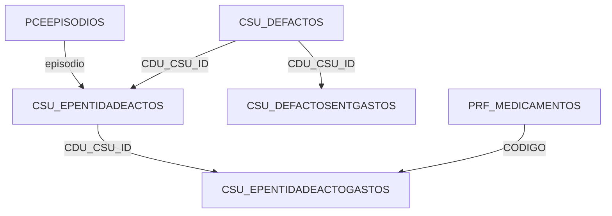

# Referência Rápida - Base de Dados PCE

## 🎯 Queries Essenciais

### 1. Listar Actos Disponíveis

```sql
SELECT 
  CDU_CSU_ID,
  CDU_CSU_CODIGO,
  CDU_CSU_DESCRICAO
FROM PCE.CSU_DEFACTOS
WHERE CDU_CSU_DESCRICAO IS NOT NULL
ORDER BY CDU_CSU_DESCRICAO
```

### 2. Buscar Artigos de um Acto

```sql
SELECT 
  g.CDU_CSU_ARTIGO as CODIGO,
  g.CDU_CSU_DESCRICAO as DESCRICAO,
  g.CDU_CSU_QUANTIDADE as QTD_PADRAO,
  g.CDU_CSU_ACTIVO as ACTIVO
FROM PCE.CSU_DEFACTOSENTGASTOS g
WHERE g.CDU_CSU_ACTOID = :actoid
  AND g.CDU_CSU_ACTIVO = 1
```

### 3. Registar Novo Acto

```sql
-- 1. Inserir acto
INSERT INTO PCE.CSU_EPENTIDADEACTOS (
  EPISODIO,
  CDU_CSU_ACTOID,
  CDU_CSU_DATA,
  CDU_CSU_UTILIZADOR,
  CDU_CSU_EXPORTADO,
  CDU_CSU_GERADOAUTOM,
  MODULO
) VALUES (
  :episodio,
  :actoid,
  SYSDATE,
  :utilizador,
  0,
  0,
  :modulo
)

-- 2. Obter ID gerado
SELECT ISEQ$$_654576.CURRVAL FROM DUAL

-- 3. Inserir artigos
INSERT INTO PCE.CSU_EPENTIDADEACTOGASTOS (
  CDU_CSU_EPISODIOENTIDADEACTOID,
  CDU_CSU_ARTIGO,
  CDU_CSU_QUANTIDADE,
  CDU_CSU_VALOR,
  CDU_CSU_UTILIZADOR
) VALUES (
  :id_acto,
  :codigo_artigo,
  :quantidade,
  0,
  :utilizador
)
```

### 4. Buscar Tratamentos de um Episódio

```sql
SELECT 
  a.CDU_CSU_ID,
  a.CDU_CSU_DATA,
  d.CDU_CSU_DESCRICAO,
  a.CDU_CSU_UTILIZADOR,
  a.CDU_CSU_EXPORTADO
FROM PCE.CSU_EPENTIDADEACTOS a
JOIN PCE.CSU_DEFACTOS d ON a.CDU_CSU_ACTOID = d.CDU_CSU_ID
WHERE a.EPISODIO = :episodio
ORDER BY a.CDU_CSU_DATA DESC
```

## 📊 Estrutura de Dados

### CSU_EPENTIDADEACTOS (Actos Registados)

| Campo | Tipo | Descrição |
|-------|------|-----------|
| CDU_CSU_ID | NUMBER | ID autoincrement |
| EPISODIO | VARCHAR2(15) | Número do episódio |
| CDU_CSU_ACTOID | VARCHAR2(36) | GUID do acto (FK) |
| CDU_CSU_DATA | DATE | Data/hora do registo |
| CDU_CSU_UTILIZADOR | VARCHAR2(20) | ID do utilizador |
| CDU_CSU_EXPORTADO | NUMBER(1) | 0=Pendente, 2=Exportado, 9=Erro |
| MODULO | VARCHAR2(15) | URG, INT, CON, etc |

### CSU_EPENTIDADEACTOGASTOS (Artigos Consumidos)

| Campo | Tipo | Descrição |
|-------|------|-----------|
| CDU_CSU_ID | NUMBER | ID autoincrement |
| CDU_CSU_EPISODIOENTIDADEACTOID | NUMBER | FK para acto |
| CDU_CSU_ARTIGO | NVARCHAR2(96) | Código do artigo |
| CDU_CSU_QUANTIDADE | NUMBER(18,5) | Quantidade usada |
| CDU_CSU_VALOR | NUMBER(18,2) | Valor (geralmente 0) |

## 🔧 Códigos de Estado

### CDU_CSU_EXPORTADO

- `0` - Pendente de exportação
- `2` - Exportado com sucesso
- `9` - Erro na exportação (ver campo ERRO)

### Módulos (MODULO)

- `URG` - Urgência
- `INT` - Internamento
- `CON` - Consulta
- `HD` - Hospital Dia
- `BLO` - Bloco Operatório

## 💡 Dicas de Performance

### 1. Índices Importantes

- `CSU_EPENTIDADEACTOS.EPISODIO` - Buscar por episódio
- `CSU_EPENTIDADEACTOS.CDU_CSU_EXPORTADO` - Filtrar por estado
- `CSU_EPENTIDADEACTOGASTOS.CDU_CSU_EPISODIOENTIDADEACTOID` - Join com actos

### 2. Queries Lentas Conhecidas

- Agregações em `CSU_EPENTIDADEACTOS` sem filtro de data
- Joins com `PRF_PRESC_MOV_FDET` (tabela com 2M+ registros)

### 3. Optimizações Recomendadas

```sql
-- Usar ROWNUM para limitar resultados
SELECT * FROM (
  -- query complexa aqui
) WHERE ROWNUM <= 100

-- Usar hints para forçar índice
SELECT /*+ INDEX(a IDX_CSU_EXPORTADO) */ *
FROM PCE.CSU_EPENTIDADEACTOS a
WHERE a.CDU_CSU_EXPORTADO = 0
```

## 🚨 Validações Importantes

### Antes de Inserir Acto

1. Verificar se episódio existe em `PCEEPISODIOS`
2. Verificar se `CDU_CSU_ACTOID` existe em `CSU_DEFACTOS`
3. Verificar se utilizador existe em `UTILIZADORES`

### Antes de Inserir Artigo

1. Verificar se código existe em `PRF_MEDICAMENTOS` ou catálogo de artigos
2. Validar quantidade > 0
3. Verificar se afeta stock (`AFETA_STOCK = 1`)

## 📝 Exemplo Completo

```javascript
// 1. Buscar actos disponíveis
const actos = await getActosDisponiveis();

// 2. Selecionar acto e buscar artigos
const artigos = await getArtigosDoActo(actoId);

// 3. Registar acto
const novoActoId = await registarActo({
  episodio: '12345678',
  actoid: 'B646664D-E957-4CE9-96CD-6094C307F934',
  utilizador: '0123',
  modulo: 'URG'
});

// 4. Registar artigos consumidos
for (const artigo of artigosConsumidos) {
  await registarArtigoConsumido({
    actoId: novoActoId,
    codigo: artigo.codigo,
    quantidade: artigo.quantidade,
    utilizador: '0123'
  });
}
```

## 🔗 Tabelas Relacionadas


